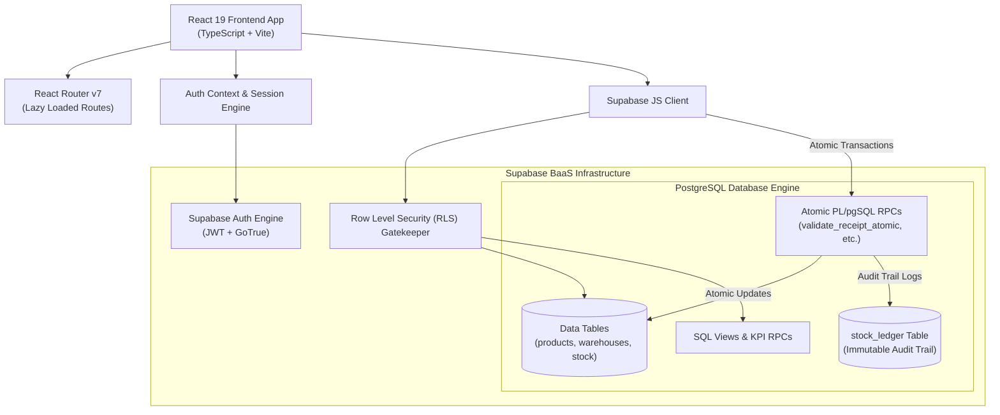
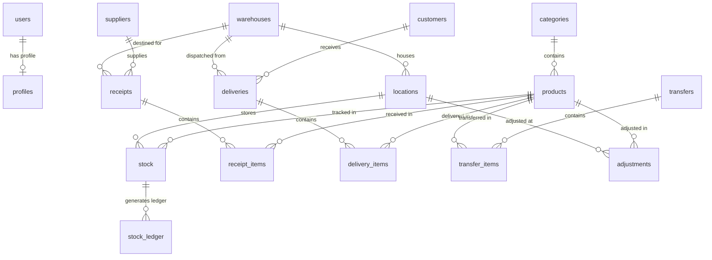
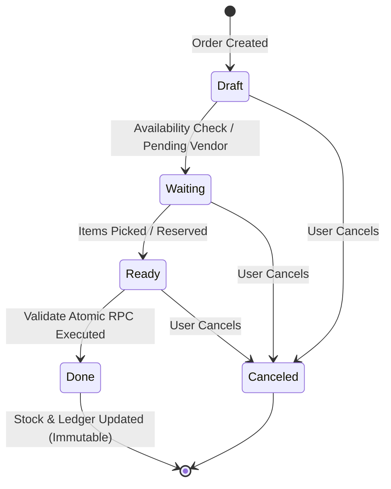
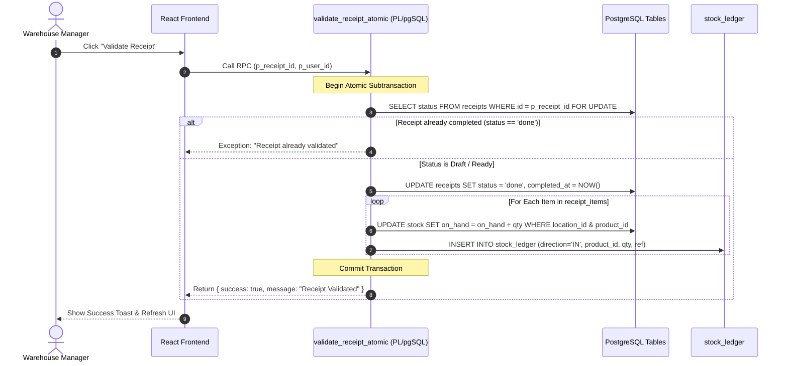

# Odoo x LPU Jalandhar Hackathon 2026

### 👥 Team Members
- **Parmeet Singh** — [`@ParmeetCS`](https://github.com/ParmeetCS)
- **Manish Manghra** — [`@Manish0101-spec`](https://github.com/Manish0101-spec)
- **Harpreet Singh Cheema** — [`@Harpreet-x17`](https://github.com/Harpreet-x17)
- **Lakhvir Singh** — [`@lakhvir2507`](https://github.com/lakhvir2507)

---

# StockSense WMS — Enterprise Inventory & Warehouse Management System

StockSense is a high-performance, real-time Enterprise Warehouse Management System (WMS) built with React 19, TypeScript, Vite, Tailwind CSS v4, and Supabase. It implements an atomic, double-entry inventory ledger engine designed according to standard logistics and supply chain principles.

> [!IMPORTANT]
> **📧 New User Email Confirmation**: Upon signing up for a new account, Supabase dispatches a verification link to your email mailbox. **Please check your email and click the confirmation link** to verify your account before logging in to the dashboard.

---

## 1. Architecture & Tech Stack

- **Frontend Core:** React 19, TypeScript 6.0, Vite 8
- **Styling & UI:** Tailwind CSS v4, Lucide React icons, Vanilla CSS utility tokens
- **Data & Backend:** Supabase (PostgreSQL 15+), Realtime subscriptions, Row Level Security (RLS), Atomic Stored Procedures (PL/pgSQL RPCs)
- **State & Router:** React Router v7 with dynamic route lazy-loading, Custom URL Sync Hooks, Context API for Auth & Toast Notifications
- **Testing & Quality:** Vitest 5.0, Oxlint static analysis, TypeScript strict mode



---

## 2. Environment Variables Configuration

To run StockSense locally or deploy to production, create a `.env` file in the root directory:

```env
# Supabase Backend Configuration (Vite)
VITE_SUPABASE_URL=https://your-supabase-project-id.supabase.co
VITE_SUPABASE_ANON_KEY=your-supabase-anon-key

# Optional Fallbacks
NEXT_PUBLIC_SUPABASE_URL=https://your-supabase-project-id.supabase.co
NEXT_PUBLIC_SUPABASE_PUBLISHABLE_KEY=your-supabase-anon-key
```

> [!IMPORTANT]
> Never commit production API keys or service role keys to version control. The client application uses the anonymous public key with Row Level Security (RLS) policies enforcing column-level & row-level authorization.

---

## 3. Database Schema & Entity Relationship Diagram (ERD)

### Database ERD Diagram



---

## 4. Inventory Transaction Workflows

### Inventory Document Lifecycle



### Atomic Execution Sequence (e.g. Inbound Receipt Validation)



---

## 5. Supabase API & Data Operations Specification

### 5.1. Authentication & User Roles

| Operation | Supabase API / RPC / Table | Inputs | Outputs | Auth & RLS | Business Rules & Errors |
|---|---|---|---|---|---|
| **Sign In (Password)** | `supabase.auth.signInWithPassword()` | `email`, `password` | `Session`, `User` | Public | Validates credentials; returns auth token. |
| **SMS OTP Login** | `send_otp` RPC / API | `phone` (E.164) | `{ success, message }` | Public | Generates & dispatches 6-digit OTP code via Textlocal SMS gateway. |
| **Verify OTP** | `supabase.auth.verifyOtp()` | `phone`/`email`, `token` | `Session`, `User` | Public | Validates 6-digit token before expiry. |
| **Sign Up** | `supabase.auth.signUp()` | `email`, `password`, `full_name`, `role` | `User`, Profile Record | Public | Creates profile record with role (`inventory_user`, `manager`, `admin`). Sends verification email to mailbox; user must click confirmation link before signing in. |
| **Sign Out** | `supabase.auth.signOut()` | None | Void | Authenticated | Clears current user session and local tokens. |

---

### 5.2. Products & Catalog Management

| Operation | Supabase API / Table | Inputs | Outputs | Auth & RLS | Business Rules & Errors |
|---|---|---|---|---|---|
| **List Products** | Table `products` join `categories` | `search`, `category_id`, `status`, `page`, `pageSize` | `Product[]`, `totalCount` | Authenticated | Paginated query. Returns active and archived products. Filterable by SKU or name. |
| **Create Product** | Table `products` | `name`, `sku`, `category_id`, `cost_price`, `sale_price`, `reorder_level` | `Product` | Manager / Admin | SKU must be unique. Duplicate SKU raises `23505` unique violation error. |
| **Update Product** | Table `products` | `id`, partial `Product` payload | `Product` | Manager / Admin | Updates catalog fields, pricing, and safety reorder thresholds. |
| **Initial Stock Setup** | RPC `initialize_product_stock` | `product_id`, `warehouse_id`, `location_id`, `quantity` | `Stock` | Manager / Admin | Creates initial stock balance and logs an `INIT` transaction in `stock_ledger`. |

---

### 5.3. Warehouses & Bins (Locations)

| Operation | Supabase API / Table | Inputs | Outputs | Auth & RLS | Business Rules & Errors |
|---|---|---|---|---|---|
| **List Warehouses** | Table `warehouses` | `search`, `is_active` | `Warehouse[]` | Authenticated | Returns code (`WH01`), facility name, address, and active state. |
| **Create Warehouse** | Table `warehouses` | `code`, `name`, `address` | `Warehouse` | Manager / Admin | Code must be unique uppercase alphanumeric (e.g. `WH01`). |
| **List Locations** | Table `locations` join `warehouses` | `warehouse_id`, `location_type` | `Location[]` | Authenticated | Location types: `internal`, `vendor`, `customer`, `inventory_loss`. |
| **Create Location** | Table `locations` | `warehouse_id`, `code`, `name`, `location_type` | `Location` | Manager / Admin | Location codes must be unique per warehouse (e.g. `WH01-A-101`). |

---

### 5.4. Stock Balances & Real-Time Quantities

| Operation | Supabase API / Table | Inputs | Outputs | Auth & RLS | Business Rules & Errors |
|---|---|---|---|---|---|
| **Get Stock Balances** | View `view_stock_levels` / Table `stock` | `warehouse_id`, `location_id`, `product_id` | `Stock[]` | Authenticated | Calculates `on_hand`, `reserved`, and `free_to_use` (`on_hand - reserved`). |
| **Stock Breakdown** | Table `stock` join `locations` | `product_id` | `LocationStock[]` | Authenticated | Returns exact on-hand and reserved counts broken down by bin location. |

---

### 5.5. Inbound Receipts (`WH/IN/xxxx`)

| Operation | Supabase API / RPC / Table | Inputs | Outputs | Auth & RLS | Business Rules & Errors |
|---|---|---|---|---|---|
| **List Receipts** | Table `receipts` join `suppliers`, `warehouses` | `search`, `status`, `warehouse_id`, `dateRange` | `Receipt[]` | Authenticated | Statuses: `draft`, `waiting`, `ready`, `done`, `canceled`. |
| **Create Receipt** | Table `receipts` & `receipt_items` | `reference`, `supplier_id`, `destination_location_id`, `items[]` | `Receipt` | Authenticated | Saves order reference, vendor, scheduled date, and line items. |
| **Validate Receipt (Atomic)** | RPC `validate_receipt_atomic` | `p_receipt_id`, `p_user_id` | `{ success, reference, message }` | Authenticated | **Atomic Engine Execution:** Updates status to `done`, increments destination `stock.on_hand`, and logs `IN` movement in `stock_ledger`. Prevents double completion. |

---

### 5.6. Outbound Deliveries (`WH/OUT/xxxx`)

| Operation | Supabase API / RPC / Table | Inputs | Outputs | Auth & RLS | Business Rules & Errors |
|---|---|---|---|---|---|
| **List Deliveries** | Table `deliveries` join `customers`, `warehouses` | `search`, `status`, `warehouse_id` | `Delivery[]` | Authenticated | Statuses: `draft`, `waiting`, `ready`, `done`, `canceled`. |
| **Validate Delivery (Atomic)** | RPC `validate_delivery_atomic` | `p_delivery_id`, `p_user_id` | `{ success, reference, message }` | Authenticated | Checks if source `free_to_use` stock (`on_hand - reserved`) >= demanded quantity. If stock is insufficient, throws `Insufficient Stock` error. Updates status to `done`, decrements `on_hand`, and logs `OUT` move in `stock_ledger`. |

---

### 5.7. Internal Transfers (`WH/INT/xxxx`)

| Operation | Supabase API / RPC / Table | Inputs | Outputs | Auth & RLS | Business Rules & Errors |
|---|---|---|---|---|---|
| **List Transfers** | Table `transfers` join `locations` | `search`, `status`, `source_wh_id`, `dest_wh_id` | `Transfer[]` | Authenticated | Tracks stock movement between internal locations or warehouses. |
| **Validate Transfer (Atomic)** | RPC `validate_transfer_atomic` | `p_transfer_id`, `p_user_id` | `{ success, reference, message }` | Authenticated | Atomically decrements source location `on_hand`, increments destination location `on_hand`, and writes dual `INT` entries in `stock_ledger`. Total company stock balance remains unchanged. |

---

### 5.8. Inventory Adjustments (`ADJ/xxxx`)

| Operation | Supabase API / RPC / Table | Inputs | Outputs | Auth & RLS | Business Rules & Errors |
|---|---|---|---|---|---|
| **Create Adjustment** | Table `adjustments` | `product_id`, `location_id`, `counted_qty`, `reason` | `Adjustment` | Authenticated | Calculates discrepancy: `difference = counted_qty - theoretical_qty`. Reasons: `Damaged`, `Lost`, `Found`, `Counting Error`. |
| **Validate Adjustment (Atomic)** | RPC `validate_adjustment_atomic` | `p_adjustment_id`, `p_user_id` | `{ success, difference, message }` | Authenticated | Overwrites location `stock.on_hand` with counted physical quantity. Logs `ADJ` entry with discrepancy difference in `stock_ledger`. |

---

### 5.9. Move History & Audit Trail

| Operation | Supabase API / Table | Inputs | Outputs | Auth & RLS | Business Rules & Errors |
|---|---|---|---|---|---|
| **Get Audit Trail** | View `view_move_history` / Table `stock_ledger` | `search`, `product_id`, `warehouse_id`, `direction`, `dateRange` | `StockLedger[]` | Authenticated | Immutable audit log of all stock movements. Directions: `IN`, `OUT`, `INT`, `ADJ`, `INIT`. |

---

### 5.10. Executive Dashboard Metrics

| Operation | Supabase API / RPC | Inputs | Outputs | Auth & RLS | Business Rules & Errors |
|---|---|---|---|---|---|
| **Dashboard KPIs** | RPC `get_dashboard_kpis` | `warehouse_id`, `category_id`, `dateRange` | `{ totalProductsInStock, lowStockItemsCount, outOfStockItemsCount, pendingReceiptsCount, pendingDeliveriesCount, scheduledTransfersCount }` | Authenticated | Computes high-performance aggregate metrics on database engine without loading raw tables into frontend memory. |

---

## 6. Security & Authorization Model

### Row Level Security (RLS) Policies
All database tables have RLS enabled (`ALTER TABLE ... ENABLE ROW LEVEL SECURITY`).
- **Authenticated Access:** All logged-in users with valid JWT tokens can view operational data.
- **Role-Based Mutate Access:** Only users with `manager` or `admin` role can create/update products, warehouses, and master settings.
- **Stock Mutation Protection:** Direct updates to `stock.on_hand` from frontend client code are disabled. All stock mutations MUST be executed via atomic SECURITY DEFINER stored procedures (`RPC`).

---

## 7. Development & Verification Commands

```bash
# Install dependencies
npm install

# Run Vite local dev server
npm run dev

# Run TypeScript type check
npx tsc --noEmit

# Run unit & integration tests
npm test

# Run Oxlint static analysis
npm run lint

# Build production bundle
npm run build
```
